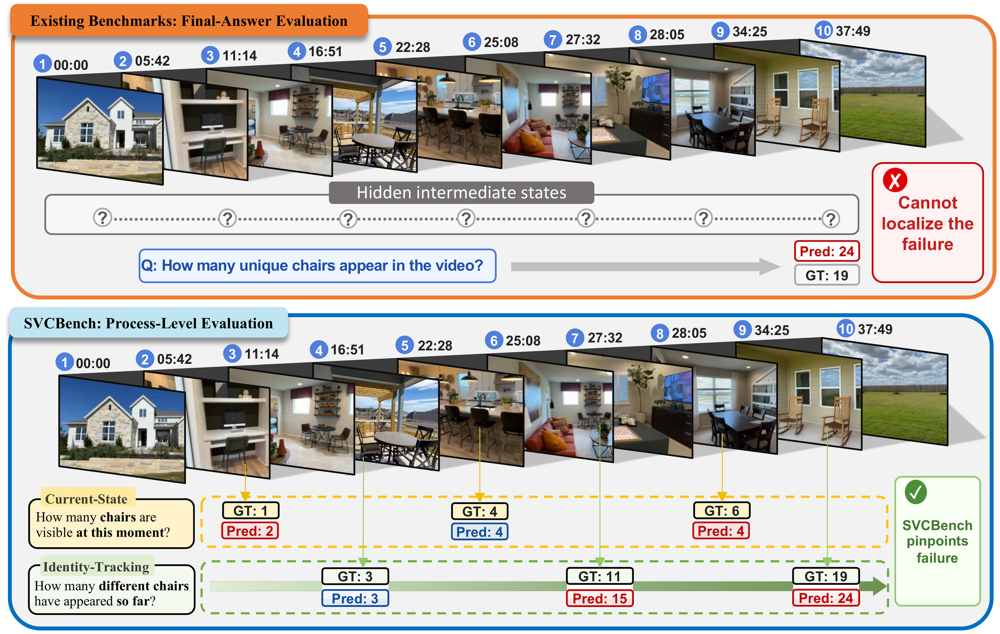

<div align="center">

<h1>SVCBench: A Streaming Video Counting Benchmark for Spatial-Temporal State Maintenance</h1>

<div>
    <a href='https://github.com/buaaplay' target='_blank'>Pengyiang Liu</a><sup>1</sup>&emsp;
    Zhongyue Shi<sup>1</sup>&emsp;
    Hongye Hao<sup>1</sup>&emsp;
    Qi Fu<sup>1</sup>&emsp;
    Xueting Bi<sup>1</sup>&emsp;
    Siwei Zhang<sup>1</sup>&emsp;
    Xiaoyang Hu<sup>1</sup>&emsp;
    Zitian Wang<sup>1</sup>&emsp;
    Linjiang Huang<sup>1</sup>&emsp;
    Si Liu<sup>1</sup>
</div>
<div>
    <sup>1</sup>Beihang University
</div>

<div>
    <h4 align="center">
        <a href="https://arxiv.org/abs/2603.12703" target='_blank'>
        
        </a>
        <a href="https://huggingface.co/datasets/buaaplay/SVCBench" target='_blank'>
        
        </a>
        <a href="#-citation" target='_blank'>
        
        </a>
    </h4>
</div>

<strong>SVCBench is a streaming video counting benchmark that treats counting as a minimal probe for diagnosing spatial-temporal state maintenance in video-language models.</strong>

<div style="text-align:center">

</div>

---

</div>

## 📢 News

* **[2026-03]** 🔥 SVCBench paper is released on [arXiv](https://arxiv.org/abs/2603.12703).
* **[2026-04]** 🚀 Code, evaluation scripts, and benchmark data are open-sourced.
* **[2026-06]** 🎉 SVCBench is accepted to **ECCV 2026**!

## 💡 Highlights

* **Streaming Evaluation Protocol**. SVCBench queries a model at multiple time points during video playback and measures how its predictions evolve over time, rather than only checking a single final answer.
* **Fine-grained Taxonomy**. The benchmark decomposes counting into 8 subcategories across two axes (object counting & event counting), covering current-state snapshots, state deltas, identity tracking, windowed gains, atomic actions, state transitions, episodic segments, and periodic actions.
* **Large-scale Annotations**. 406 videos, 1,000 questions, 4,576 query points, and 10,071 annotated event/state-change moments.
* **Three Complementary Metrics**. GPA (Gaussian Precision Accuracy), MoC (Monotonicity Consistency), and UDA (Update Detection Accuracy) for comprehensive evaluation.

## 🛠️ Usage

### Installation

```bash
pip install -r requirements.txt
```

### Data Preparation

Download the benchmark videos from Hugging Face:

```bash
huggingface-cli download buaaplay/SVCBench --repo-type dataset --local-dir data/videos
```

The videos should be organized as:

```text
data/videos/
  RoomTour3D/
    -FZTi5EfPSQ.mp4
  scannetpp/
    09c1414f1b.mp4
  ...
```

### Evaluation

#### One-Command Demo

Set your Gemini API key and run:

```bash
export GEMINI_API_KEY="your-gemini-api-key"
bash run_gemini_eval.sh --video-dir data/videos --limit 5
```

The script will:
1. Run Gemini on a demo slice of SVCBench
2. Write raw per-query-point outputs to `outputs/`
3. Convert the raw file to unified format
4. Compute GPA, MoC, and UDA

#### Manual Steps

**Step 1: Run model inference**

```bash
python eval/demo_gemini.py \
  --video-dir data/videos \
  --input data/vcbench_eval.jsonl \
  --limit 5
```

**Step 2: Convert to unified format**

```bash
python eval/unify_results.py outputs/vcbench_gemini_demo_*.jsonl outputs/unified.jsonl
```

**Step 3: Compute metrics**

```bash
python eval/compute_metrics.py outputs/unified.jsonl data/vcbench_eval.jsonl
```

### Metric Definitions

| Metric | Description | Direction |
|--------|-------------|-----------|
| GPA | Gaussian Precision Accuracy | Higher is better |
| MoC | Monotonicity Consistency | Higher is better |
| UDA | Update Detection Accuracy | Higher is better |

## 📝 Citation

If you find this work useful, please consider citing our paper:

```bibtex
@misc{liu2026svcbench,
      title={SVCBench: A Streaming Video Counting Benchmark for Spatial-Temporal State Maintenance}, 
      author={Pengyiang Liu and Zhongyue Shi and Hongye Hao and Qi Fu and Xueting Bi and Siwei Zhang and Xiaoyang Hu and Zitian Wang and Linjiang Huang and Si Liu},
      year={2026},
      eprint={2603.12703},
      archivePrefix={arXiv},
      primaryClass={cs.CV},
      url={https://arxiv.org/abs/2603.12703}, 
}
```

## 📄 License

The code in this repository is released under the [Apache License 2.0](./LICENSE). The SVCBench annotations (event/state-change timestamps, per-individual first-appearance times, and streaming query points) and our self-generated physics-simulation videos are released under [CC BY 4.0](https://creativecommons.org/licenses/by/4.0/).

The source videos retain their respective original licenses, and by downloading SVCBench you agree to comply with the terms of each source: Ego4D (Ego4D License), ScanNet / ScanNet++ (Terms of Use, non-commercial research), ARKitScenes (Apple ARKitScenes license), RoomTour3D (CC BY-NC), CODa (Apache-2.0), OmniWorld (CC BY-NC), TOMATO (original TOMATO terms), and YouTube content (platform and creator terms).

## 🙏 Acknowledgement

We thank the creators of [RoomTour3D](https://github.com/roomtour3d) and [ScanNet++](https://kaldir.vc.in.tum.de/scannetpp/) for providing high-quality video data.
